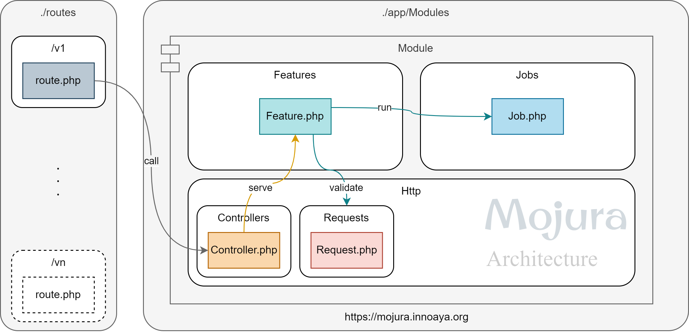

A package which provides a maintainable and scalable way to build a Laravel Application.  

---

*Want to learn more about concepts and principles?*
> **Documentation** - [https://mojura.innoaya.org](https://mojura.innoaya.org)

---

*Want to learn sample codes or want to use ready made starter kit with everything you need to start a backend project?*
> **Starter Kit** - [https://github.com/innoaya/mojura-laravel-starter](https://github.com/innoaya/mojura-laravel-starter)
